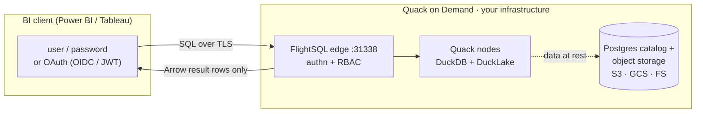

<p align="center">
  <picture>
    <source media="(prefers-color-scheme: dark)" srcset="assets/public/svg/lockupA-dark.svg">
    
  </picture>
</p>

# Quack on Demand

[](https://starlake-ai.github.io/quack-on-demand/operating/resilience)
[](https://github.com/starlake-ai/quack-on-demand/actions/workflows/snapshot.yml)
[](https://central.sonatype.com/artifact/ai.starlake/quack-on-demand_3)
[](https://hub.docker.com/r/starlakeai/quack-on-demand)
[](LICENSE)
[](https://discord.gg/xHj9D6Rebp)

**The open-source serving layer for DuckLake.** Turn a DuckLake lakehouse into a multi-tenant SQL warehouse your whole org can query: on-demand DuckDB nodes, least-loaded routing, table-level RBAC with column-level security and dynamic data masking, and Arrow Flight SQL on the wire so Power BI, Tableau, DBeaver, and any JDBC / ODBC / ADBC client just connect. Self-hosted. Single uber-jar.

DuckLake gives you a Postgres-backed lakehouse catalog. DuckDB gives you the engine. What's missing between them and a room full of analysts is the part that handles *concurrent users, authentication, authorization, and connection routing* - which DuckLake [explicitly leaves out](https://ducklake.select/faq) by design. That is Quack on Demand: think self-hosted MotherDuck, scoped to serving, on your own infrastructure.


### Project status

**Beta.** In active use against the documented surface: multi-tenant FlightSQL gateway, per-tenant DuckLake catalogs, the full RBAC graph (users / groups / roles / table permissions / pool grants), statement-level federation across external Postgres / S3 / Iceberg, and YAML-round-trippable control-plane manifests. The REST API, FlightSQL wire protocol, control-plane schema, and CLI surface are stable.

The gateway is a **single-instance manager** by design: safely restartable, but not active-active yet. Worker pools scale horizontally; the manager itself is one process. [Resilience](https://starlake-ai.github.io/quack-on-demand/operating/resilience) documents the failure-and-recovery matrix in full; multi-manager mode is tracked on the issues board.

**Documentation:** https://starlake-ai.github.io/quack-on-demand/ - full guides, configuration reference, and REST API.
Jump to: [Quickstart](https://starlake-ai.github.io/quack-on-demand/getting-started/quickstart) · [`RUNNING.md`](guides/RUNNING.md) · [`API.md`](guides/API.md) · [Architecture](https://starlake-ai.github.io/quack-on-demand/concepts/architecture) · [RBAC model](https://starlake-ai.github.io/quack-on-demand/operating/rbac-model) · [`CONTRIBUTING.md`](CONTRIBUTING.md)

---

## Who is this for?

**Use Quack on Demand if you want to:**

- Expose a DuckLake / DuckDB warehouse to multiple teams or apps over a standard wire protocol (Arrow Flight SQL: works with JDBC, ODBC, ADBC, PyArrow, DBeaver, Spark, and other Flight-aware clients)
- Authenticate users against your existing identity provider (Keycloak / Azure AD / Google / Cognito / JWT / database) and enforce table-level RBAC at query time
- Run several tenants on shared infrastructure without giving each one a private DuckDB process to manage; each tenant owns a separate DuckLake catalog DB

**Look elsewhere if you:**

- Just need a single embedded DuckDB inside one application: use DuckDB directly
- Need a distributed query engine with cross-node shuffles and joins on TB-scale tables: look at Trino / Dremio / StarRocks. Quack on Demand routes each statement to a single node; it doesn't fan out across them

## How it compares

|                              | DuckDB<br/>embedded | OSS Flight SQL servers<br/>(GizmoSQL, sqlflite) | MotherDuck | Trino /<br/>Dremio | **Quack on<br/>Demand** |
|------------------------------|:---:|:---:|:---:|:---:|:---:|
| Embedded / in-process        | ✅ | ❌ | ❌ | ❌ | ❌ |
| Self-hosted                  | ✅ | ✅ | ❌ | ✅ | ✅ |
| Open source                  | ✅ | ✅ | ❌ | ✅ | ✅ |
| Fully managed SaaS (zero ops)| ❌ | ❌ | ✅ | vendor cloud | ❌ |
| Multi-user serving           | ❌ | ✅ | ✅ | ✅ | ✅ |
| Multi-tenant isolation       | ❌ | ❌ | ✅ | ✅ | ✅ |
| Table-level RBAC             | ❌ | ❌ | ❌ | ✅ | ✅ |
| Row-level security           | ❌ | ❌ | ❌ | add-on | ✅ |
| Column security + masking    | ❌ | ❌ | ❌ | add-on | ✅ |
| Audit log                    | ❌ | ❌ | partial | via plugin | ✅ |
| Per-tenant usage metering    | ❌ | ❌ | ✅ | add-on | ✅ |
| Active-active manager HA     | n/a | ❌ | ✅ | ✅ | ✅ |
| Autoscaling node pools       | ❌ | ❌ | ✅ | ✅ | ✅ |
| Distributed joins (TB-scale) | ❌ | ❌ | ❌ | ✅ | ❌ |
| BI via JDBC / ODBC           | via files | ✅ | ✅ | ✅ | ✅ |
| DuckLake-native catalog      | ✅ | partial | ✅ | ❌ | ✅ |
| Footprint                    | library | single binary | SaaS | cluster | single uber-jar |

**Pick DuckDB** for one embedded database in one app. **Pick MotherDuck** if managed SaaS fits and data residency isn't a constraint. **Pick Trino / Dremio** for distributed joins across TB-scale tables. **Pick Quack on Demand** when you want DuckLake served to many users, with auth, table / row / column level security, an audit trail, and per-tenant usage metering, in open source, on infrastructure you control.

---

## Quick start

Zero to first query in under 5 minutes. Clone this repo, then:

```bash
cp .env.example .env                            # tweak ports / auth / admin password
LOAD_TPCH=1 ./scripts/run-docker-compose.sh     # pulls starlakeai/quack-on-demand:latest + seeds TPC-H SF=1
```
> **Windows: run inside WSL2** with `QOD_NATIVE_CLIENT=false LOAD_TPCH=1 ./scripts/run-docker-compose.sh`

That brings up Postgres + the manager, bootstraps the demo tenants `acme` (tenant-db `acme_tpch` with pools `bi` and `etl`) and `globex` (pool `bi`), and seeds the DuckLake catalog with TPC-H at scale factor 1 (~6M lineitem rows) into `acme_tpch.tpch1`. The admin UI is on `http://localhost:20900/ui/` (log in `admin` / `admin` - change both before exposing anything beyond `localhost`). The FlightSQL edge is on `localhost:31338`; every client scopes its session with `tenant=acme` + `pool=bi`.

Connect a BI tool or JDBC client:

```
jdbc:arrow-flight-sql://localhost:31338?useEncryption=true&disableCertificateVerification=true&user=admin&password=admin&tenant=acme&pool=bi
```

ODBC strings, the Power BI walkthrough, ADBC `db_kwargs`, and the Python load tester are in **[Quickstart](https://starlake-ai.github.io/quack-on-demand/getting-started/quickstart)** and **[Connecting clients](https://starlake-ai.github.io/quack-on-demand/connecting/clients)**.

Runnable client examples live in [`examples/`](examples/): FlightSQL clients in [TypeScript](examples/typescript/), [Python](examples/python/), [Java](examples/java/), and [Rust](examples/rust/), each running a single query and the 22 TPC-H queries. An [n8n community node](https://github.com/starlake-ai/qod-n8n-node) lives in its own repo.

**Other paths:** `./scripts/run-jar.sh` for a bare-JVM run (downloads the released uber-jar, `QOD_VERSION=BUILD` builds from this checkout). The Helm chart + a local kind smoke-test rig live under [`charts/quack-on-demand/`](charts/quack-on-demand/). See [`RUNNING.md`](guides/RUNNING.md) for external Postgres, env vars, and TLS.

---

## Features

### Security & identity

- **Arrow Flight SQL edge** with auto-generated self-signed TLS (drop in a CA-signed cert for prod)
- **Pluggable authentication**: Postgres / any JDBC backend (BCrypt passwords), external JWT (HS256 / RS256 / PEM), or OIDC (Keycloak with ROPC, Google, Azure AD, AWS Cognito)
- **First-class RBAC graph** - two gates at handshake (user-scope, pool-access) plus per-statement table and column level checks against a cached **EffectiveSet**. See the [RBAC model](https://starlake-ai.github.io/quack-on-demand/operating/rbac-model)
- **Column-level security & dynamic data masking** - per-role policies on `catalog.schema.table.column` either **deny** the column or **mask** it through a custom SQL transform, applied by rewriting each statement at the edge before it reaches a node. Row-level security (predicate filters) ships too, behind an experimental `QOD_RLS_ENABLED` flag
- **Admin REST API** with an `X-API-Key` static key OR a session token from `/api/auth/login`

### Data plane

- **Multi-tenant pools** of Quack nodes (`READONLY` / `WRITEONLY` / `DUAL`); the router classifies each statement and picks a compatible least-loaded node
- **Per-tenant DuckLake catalog DB** (`${tenant}_${tenantDb}`) auto-provisioned next to the control-plane DB - tenant isolation at the Postgres-database boundary, not just row level
- **Single uber-jar** deployment

### Operability

- **React admin console** at `http://localhost:20900/ui/` - tenant / pool / user CRUD, per-user "Effective permissions" drilldown, live node dashboard (in-flight, total served, EWMA latency)
- **Observability built in** - Prometheus `/metrics`, or push to CloudWatch / Azure Monitor / GCP. Ships a Grafana dashboard at [observability/grafana-dashboard.json](observability/grafana-dashboard.json)
- **Self-healing on restart** - the registry is reconciled against the runtime backend; dead nodes are respawned before the edge accepts traffic. Full matrix in [Resilience](https://starlake-ai.github.io/quack-on-demand/operating/resilience)
- **Every config key is overridable** via a `QOD_*` env var

---

## Architecture

### Data residency - the base tables never leave the server

When Power BI or Tableau connect with a **live / DirectQuery** connection, each user interaction issues SQL over the FlightSQL wire. The query runs on a Quack node, against DuckLake data that stays in your object storage, and only the *result rows* stream back as an Arrow batch. The base tables never cross the trust boundary onto the analyst's machine.



> **Live / DirectQuery only.** Power BI **Import** mode and Tableau **extract** mode copy the full dataset into a local `.pbix` / `.hyper` file by design - that data lands on the client regardless of the gateway. Use a live / DirectQuery connection when server-side residency is the goal.

---

## Configuration

Every scalar in `application.conf` accepts a matching `QOD_*` env-var override. The security-critical ones to set before any non-localhost deploy:

| Setting | Env var | Default |
|---|---|---|
| Static admin key | `QOD_API_KEY` | unset (open if unset!) |
| Session JWT secret | `QOD_SESSION_JWT_SECRET` | well-known dev string (change!) |
| Admin password | `QOD_ADMIN_PASSWORD` | `admin` (change!) |
| Metastore password | `QOD_PG_PASSWORD` | `azizam` (change!) |
| Enable per-statement RBAC | `QOD_ACL_ENABLED` | `false` |

Full reference: [Configuration](https://starlake-ai.github.io/quack-on-demand/reference/configuration).

---

## License

Apache 2.0.

## Community

- **Questions / discussion** -> [Discord](https://discord.gg/xHj9D6Rebp)
- **Bug or feature** -> file an issue using the templates

## Contributing

PRs welcome. See [CONTRIBUTING.md](CONTRIBUTING.md) for the dev loop and [CODE_OF_CONDUCT.md](CODE_OF_CONDUCT.md) for community standards. Start with an issue labelled `good first issue`.
