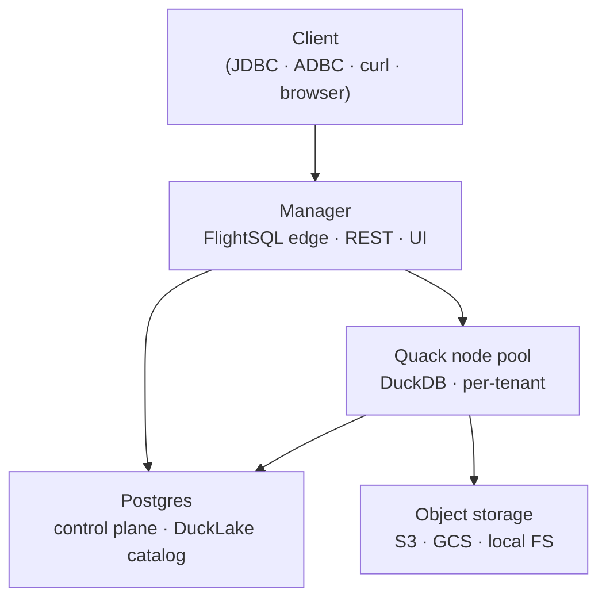
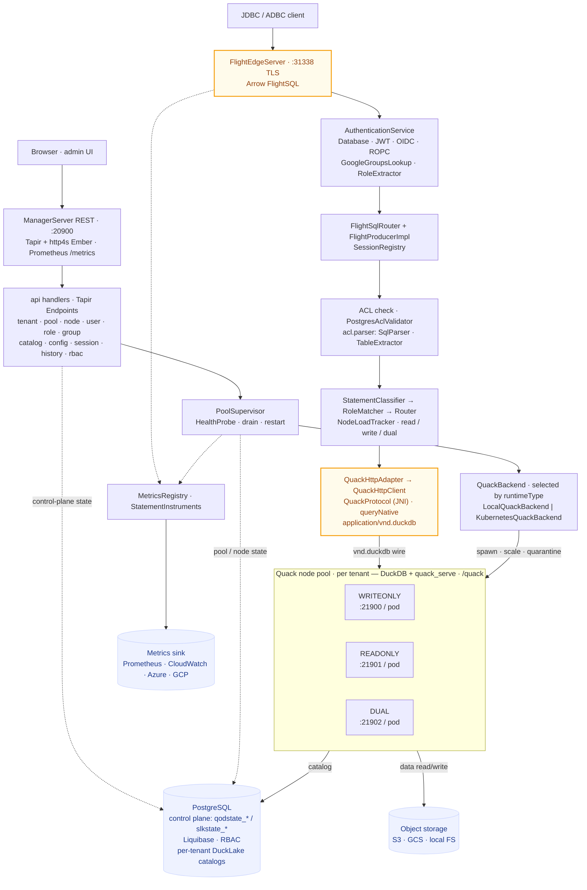

<p align="center">
  <picture>
    <source media="(prefers-color-scheme: dark)" srcset="assets/public/svg/lockupA-dark.svg">
    
  </picture>
</p>

# Quack on Demand

[](https://starlake-ai.github.io/quack-on-demand/operating/resilience)
[](https://github.com/starlake-ai/quack-on-demand/actions/workflows/snapshot.yml)
[](https://central.sonatype.com/artifact/ai.starlake/quack-on-demand_3)
[](https://hub.docker.com/r/starlakeai/quack-on-demand)
[](LICENSE)
[](https://discord.gg/VTxrj8KU)

**Multi-tenant Arrow Flight SQL gateway for DuckDB, per-tenant DuckLake catalog, per-tenant pools, first-class RBAC graph (users · groups · roles · table permissions · pool grants), pluggable identity. Single uber-jar.**

Any JDBC / ODBC / ADBC client connects to one Flight SQL edge; the gateway authenticates the user (DB / JWT / OIDC), gates the connection at handshake (user-scope + pool-access), parses each statement and matches its table refs against the user's cached **EffectiveSet**, then routes the statement to a compatible node in the tenant's pool. Each tenant owns its own DuckLake catalog database; the manager's normalized `qodstate_*` control plane sits in a separate database next to them.

### Why this exists

DuckDB's [Quack](https://duckdb.org/docs/current/core_extensions/quack) protocol lets DuckDB instances talk to each other over HTTP/2. DuckDB is no longer just an embedded library. But Quack is intentionally minimal: a single static token for auth, no multi-tenancy, no authorization model, DuckDB-only on the client side. The docs themselves recommend putting infrastructure in front of it before any serious deployment. Quack on Demand is that infrastructure.

### Project status

**Beta.** Quack on Demand is in active use against the documented surface: multi-tenant FlightSQL gateway, per-tenant DuckLake catalogs, the full RBAC graph (users / groups / roles / table permissions / pool grants), statement-level federation across external Postgres / S3 / Iceberg via DuckDB extensions, and YAML-round-trippable control-plane manifests. The REST API, FlightSQL wire protocol, control-plane schema, and CLI surface are all considered stable.

The gateway is a **single-instance manager** by design: safely restartable, but not active-active yet. Worker pools scale horizontally; the manager itself is one process. [`RESILIENCE.md`](https://starlake-ai.github.io/quack-on-demand/operating/resilience) documents the failure-and-recovery matrix in full so operators can decide where it fits. Roadmap work toward a multi-manager mode is tracked on the GitHub issues board.


---

## Contents

- [Who is this for?](#who-is-this-for)
- [Quick start](#quick-start)
- [Features](#features)
- [Architecture](#architecture)
- [Configuration](#configuration)
- [Access control (RBAC)](#access-control-rbac)
- [License](#license)
- [Community](#community)
- [Contributing](#contributing)

**Documentation:** https://starlake-ai.github.io/quack-on-demand/ (full guides, configuration reference, and REST API).

Companion files: [Quickstart](https://starlake-ai.github.io/quack-on-demand/getting-started/quickstart) (zero-to-first-query) - [`RUNNING.md`](guides/RUNNING.md) (deployment paths + operator notes) - [`API.md`](guides/API.md) (REST API reference) - [Resilience](https://starlake-ai.github.io/quack-on-demand/operating/resilience) (failure / recovery matrix) - [`CONTRIBUTING.md`](CONTRIBUTING.md) (dev loop)

---

## Who is this for?

**Use Quack on Demand if you want to:**

- Expose a DuckLake / DuckDB warehouse to multiple teams or apps over a standard wire protocol (Arrow Flight SQL: works with JDBC, ODBC, ADBC, PyArrow, DBeaver, Spark, and other Flight-aware clients)
- Authenticate users against your existing identity provider (Keycloak / Azure AD / Google / Cognito / JWT / database) and enforce table-level RBAC at query time, with a per-user EffectiveSet built from role + group memberships
- Run several tenants on shared infrastructure without giving each one a private DuckDB process to manage; each tenant owns a separate DuckLake catalog DB (`${tenant}_${tenantDb}`)

**Look elsewhere if you:**

- Just need a single embedded DuckDB inside one application ? use DuckDB directly
- Need a distributed query engine over data lakes with cross-node shuffles and joins on TB-scale tables then look at Trino / Dremio / StarRocks. Quack on Demand routes each statement to a single Quack node; it doesn't fan out across them

---

## Quick start

Zero to first query in under 5 minutes ? Clone this repo first then see **[Quickstart](https://starlake-ai.github.io/quack-on-demand/getting-started/quickstart)** for the step-by-step. 

The short version:

```bash
cp .env.example .env                            # tweak ports / auth / admin password
LOAD_TPCH=1 ./scripts/run-docker-compose.sh     # pulls starlakeai/quack-on-demand:latest + seeds TPC-H SF=1
```
> **Windows users: run inside WSL2**
>
> ```bash
> QOD_NATIVE_CLIENT=false LOAD_TPCH=1 ./scripts/run-docker-compose.sh
> ```

That brings up Postgres + the manager, bootstraps the `tpch` tenant with a `tpch1` tenant-db (catalog DB `tpch_tpch1`) and a `sales` pool of 3 nodes (WO/RO/Dual), and seeds the DuckLake catalog with TPC-H at scale factor 1 (~6M lineitem rows) into schema `tpch1`. The admin UI is on `http://localhost:20900/ui/`. Log in as `admin` (or the equivalent `admin@localhost.local`; `QOD_ADMIN_USERNAME` is a comma-separated list) with password `admin`. Change both before exposing anything beyond `localhost`. The FlightSQL edge is on `localhost:31338`; every client scopes its session with `tenant=tpch` + `pool=sales` (JDBC URL param / ADBC call-header / loadtest `--tenant`/`--pool` flag).

**Prefer a bare-JVM run?** `./scripts/run-jar.sh` downloads the latest released uber-jar, probes Postgres, and `exec`s `java -jar` with the Arrow allocator pinned. `BUILD=1 ./scripts/run-jar.sh` builds from this checkout first. See [`RUNNING.md`](guides/RUNNING.md) for the full native path (external Postgres, env vars, TLS).

**Want to smoke-test the Helm chart on a local kind cluster?**
[`charts/quack-on-demand/local-stack-k8s/run-local-stack-k8s.sh`](charts/quack-on-demand/local-stack-k8s/run-local-stack-k8s.sh) creates / reuses a kind cluster, applies in-cluster Postgres + SeaweedFS (S3) + Prometheus + Grafana, helm-installs the chart (TLS-on FlightSQL, manager-issued self-signed cert), and optionally seeds TPC-H inside the manager pod -- no host duckdb dependency.

```bash
LOAD_TPCH=1 ./charts/quack-on-demand/local-stack-k8s/run-local-stack-k8s.sh
```

The rig bundles Grafana pre-provisioned with the [observability/grafana-dashboard.json](observability/grafana-dashboard.json) dashboard against an in-cluster Prometheus that scrapes the manager's `/metrics` every 5s, so you can watch latencies and node load while a load test runs. See [`charts/quack-on-demand/local-stack-k8s/README.md`](charts/quack-on-demand/local-stack-k8s/README.md) for the connect-from-a-client recipes (JDBC / ADBC / REST), the load-test walkthrough, and the env-knob reference.

Smoke-test the FlightSQL edge with the Python load tester:

```bash
pip install adbc_driver_flightsql adbc_driver_manager

# TLS-on server (compose default). --tenant/--pool default to tpch/sales
# (matching the bootstrap), so no flags are needed for the demo path.
python3 ./scripts/loadtest/loadtest.py -w 2 -i 5

# Plaintext server (TLS=false in .env, or scripts/run-docker.sh default)
./scripts/loadtest/loadtest.py --url grpc://localhost:31338 -w 2 -i 5
```

Expected tail: a healthy first run looks like this (numbers depend on `-w`/`-i` and hardware):

```
Load test: 2 workers x 5 iterations (+5 warmup) against grpc+tls://localhost:31338 as admin -> tpch/sales
...
Queries OK:       10
Queries failed:   0
Latency  p50:     ~60 ms
```

`Queries failed: 0` is the success signal. `[FlightSQL] missing tenant scope for Basic auth` means a custom client connected without `tenant`/`pool` routing headers; see [Quickstart](https://starlake-ai.github.io/quack-on-demand/getting-started/quickstart) for the JDBC URL / ODBC string / ADBC db_kwargs shape. `UNAUTHENTICATED` (other variants) usually means the `.env` credentials don't match what the manager seeded; TLS errors mean a `grpc://` vs `grpc+tls://` mismatch.

**FlightSQL JDBC:**
  `jdbc:arrow-flight-sql://localhost:31338?useEncryption=true&disableCertificateVerification=true&user=admin&password=admin&tenant=tpch&pool=sales`

**FlightSQL ODBC** (Apache Arrow Flight SQL ODBC Driver from
  [arrow-adbc](https://arrow.apache.org/adbc/main/driver/flight_sql.html#odbc)
  or the [Dremio ODBC connector](https://github.com/apache/arrow-adbc/tree/main/c/driver/flightsql)):

  Register the driver in `/etc/odbcinst.ini` (Linux/macOS) - point at
  the `.so` / `.dylib` from the package:

  ```ini
  [Apache Arrow Flight SQL ODBC Driver]
  Description = Apache Arrow Flight SQL
  Driver      = /usr/local/lib/libarrow-odbc.so
  ```

  Then either use a DSN-less connection string:

  ```
  Driver={Apache Arrow Flight SQL ODBC Driver};
  HOST=localhost;PORT=31338;
  UseEncryption=true;DisableCertificateVerification=true;
  UID=admin;PWD=admin;
  adbc.flight.sql.rpc.call_header.tenant=tpch;
  adbc.flight.sql.rpc.call_header.pool=sales
  ```

**Browse the admin UI (optional) - 10 seconds**
   Open http://localhost:20900/ui/ in a browser. Log in as admin / admin

Everything else - native run, Docker against an external Postgres, TPC-H seeding, corporate proxy setup, JDBC client configuration, the full loadtest parameter table, and the [operator's pre-prod checklist](guides/RUNNING.md#operational-notes) - lives in **[`RUNNING.md`](guides/RUNNING.md)**. REST API reference is in **[`API.md`](guides/API.md)**.

---

## Features

### Security & identity

- **Arrow Flight SQL edge** with auto-generated self-signed TLS (drop in a CA-signed cert for prod)
- **Pluggable authentication** through the vendored `AuthenticationService` chain:
  - Postgres / any JDBC backend (BCrypt-hashed passwords, free-form SQL template)
  - External JWT (HS256 / RS256 / public-key PEM)
  - OIDC providers: Keycloak (with ROPC), Google, Azure AD, AWS Cognito
- **First-class RBAC graph** in `qodstate_role` / `qodstate_role_permission` / `qodstate_group` / `qodstate_user_*` / `qodstate_pool_permission`. Two gates run at handshake (user-scope, pool-access); per statement the SQL parser extracts table refs and matches them against the cached **EffectiveSet** pinned on the connection. Superusers (`qodstate_user.tenant IS NULL`) bypass both layers
- **Admin REST API** with an `X-API-Key` static key OR a session token minted via `/api/auth/login`

### Data plane

- **Multi-tenant pools** of Quack nodes. Each node is `READONLY`, `WRITEONLY`, or `DUAL`; the router classifies each statement and picks a compatible node
- **Per-tenant DuckLake catalog DB** (`${tenant}_${tenantDb}`) auto-provisioned next to the manager's control-plane DB (`qod`); tenant isolation is at the Postgres-database boundary, not just at the row level
- **Single uber-jar** deployment; the normalized `qodstate_*` control plane sits in a dedicated database alongside the per-tenant DuckLake catalogs

### Operability

- **React admin console** at `http://lcoalhost:20900/ui/` - tenant CRUD (with Databases · Pools · Auth provider tabs), pool CRUD, a dedicated **/users page** (Users · Groups · Roles · Identities tabs) with a per-user "Effective permissions" drilldown, live node dashboard (in-flight, total served, EWMA latency), admin-role gated
- **Observability built in** - Prometheus scrape endpoint at `/metrics`, or push to AWS CloudWatch / Azure Monitor / GCP Cloud Monitoring (one sink at a time, picked via `metrics.sink`). Ships with a Grafana 10.x dashboard at [observability/grafana-dashboard.json](observability/grafana-dashboard.json)
- **Self-healing on restart** - when the manager comes back up, the registry restored from the normalized `qodstate_tenant` / `qodstate_tenant_db` / `qodstate_pool` / `qodstate_node` tables is reconciled against the runtime backend: each child's recorded PID is checked, its port is probed, and any node that no longer answers is respawned before the Flight SQL edge starts accepting traffic. Full failure-and-recovery matrix in [`RESILIENCE.md`](https://starlake-ai.github.io/quack-on-demand/operating/resilience)
- **Every config key is overridable** via a `QOD_*` env var

---

## Architecture

### At a glance



One Manager process fronts every client (FlightSQL on `:31338`, REST + admin UI on `:20900`) and routes each statement to a single Quack node it spawned for the matching tenant + pool. Control-plane state and per-tenant DuckLake catalogs live in Postgres; parquet data lives in object storage. See the detailed diagram below for the auth / ACL / routing pipeline.

### In detail



**Two paths into Postgres** (not pictured to keep the diagram readable):

- The **manager** owns the control plane: it writes `qodstate_tenant` / `qodstate_tenant_db` / `qodstate_pool` / `qodstate_node` on tenant + pool CRUD, and resolves the cached **EffectiveSet** for each authenticated session from `qodstate_user` + the membership tables + `qodstate_role_permission` / `qodstate_pool_permission` at handshake.
- Each **Quack node** owns the data plane against its tenant-db: it reads and writes that DB's DuckLake `__ducklake_*` catalog tables directly when resolving and mutating tables.

Two databases per tenant-db deployment (control-plane `qod` + tenant-db `${tenant}_${tenantDb}`) keeps control-plane and DuckLake catalog cleanly separated while sharing one Postgres cluster.

---

## Configuration

Every scalar in `src/main/resources/application.conf` accepts a matching `QOD_*` env-var override. The most-used:

| Setting | Env var | Default |
|---|---|---|
| Manager REST port | `QOD_ON_DEMAND_PORT` | `20900` |
| FlightSQL edge port | `PROXY_PORT` | `31338` |
| FlightSQL TLS on/off | `PROXY_TLS_ENABLED` | `true` |
| State backend | `QOD_STATE_STORAGE` | `postgres` |
| Metastore host | `QOD_PG_HOST` | `localhost` |
| Metastore user | `QOD_PG_USER` | `postgres` |
| Metastore password | `QOD_PG_PASSWORD` | `azizam` (change this!) |
| Control-plane database | `QOD_PG_DBNAME` | `qod` |
| Static admin key | `QOD_API_KEY` | unset |
| Admin usernames | `QOD_ADMIN_USERNAME` | `admin@localhost.local,admin` |
| Admin password | `QOD_ADMIN_PASSWORD` | `admin` |
| Enable DB auth | `QOD_AUTH_DB_ENABLED` | `true` |
| Enable per-statement RBAC | `QOD_ACL_ENABLED` | `false` |

Pluggable auth backends, K8s runtime, JWT keys, per-tenant bootstrap overrides - see `application.conf` for the full surface.

---

## Access control (RBAC)

Quack on Demand's RBAC graph is a normalized model across nine `qodstate_*` tables. Auth gates run in two places: at FlightSQL **handshake** (does this user belong to this tenant + may they reach this pool?) and **per statement** (does the user's EffectiveSet cover every table the SQL parser pulls out?).

### Entities

- **User** (`qodstate_user`): identified by `(tenant, username)`. A row with `tenant IS NULL` is a **superuser**: it can authenticate against any tenant via FlightSQL and bypasses both handshake and per-statement gates. Tenant-scoped principals carry a non-empty `tenant`.
- **Role** (`qodstate_role`): per-tenant container for TablePermission rows. Every new tenant is auto-seeded with a built-in `admin` role plus a `*.*.* ALL` permission, all in one transaction (`PoolSupervisor.createTenant`).
- **Group** (`qodstate_group`): per-tenant bundle of users that inherits role memberships and pool grants together.
- **TablePermission** (`qodstate_role_permission`): `(role_id, catalog, schema, table, verb)`. `verb ∈ {SELECT, INSERT, UPDATE, DELETE, ALL}`; `*` in any of catalog/schema/table is the literal wildcard. **This is the only place table-level grants live.**
- **PoolPermission** (`qodstate_pool_permission`): grants a user OR a group access to a `(tenant, pool?)`. `pool_id NULL` means "every pool in this tenant". Exactly one of `user_id` / `group_id` is set (DB CHECK enforced).
- **Memberships**: `qodstate_user_role`, `qodstate_user_group`, `qodstate_group_role` are bare FK pairs (cascade on delete).

### Gates

Both gates resolve from the same **EffectiveSet** pinned to the FlightSQL session at handshake:

```
EffectiveSet(user) =
    direct roles
  ∪ roles inherited via every group the user is in
  ∪ table permissions attached to any role in the closure
  ∪ pool permissions on the user OR on any of its groups
                     (a row with pool=NULL matches every pool in tenant)
```

- **Handshake** uses the EffectiveSet to answer "is the requested `(tenant, pool)` covered by any PoolPermission?". Superusers skip this entirely.
- **Per statement** uses the cached EffectiveSet to answer "is every `(catalog.schema.table, verb)` extracted from the SQL covered by some TablePermission?". Same superuser bypass.

Per-statement enforcement only kicks in when `acl.enabled=true` (`QOD_ACL_ENABLED`). The handshake gate is always on for tenant-scoped users; turning the per-statement gate off is for trusted-tenant deployments where the pool gate is enough.

### Caveats

- **Per-table DML/DDL enforcement**: the SQL parser walks SELECT, INSERT/UPDATE/DELETE/MERGE/TRUNCATE, and CREATE/DROP/ALTER, extracting each table touch as a `Read`, `Write`, or `Ddl` access; the validator requires a covering grant for every access. The write verbs collapse to a single `Write` class (holding any of `INSERT`/`UPDATE`/`DELETE` authorizes all writes on the matched tables), and DDL is authorized by an `ALL` grant since the operator-facing verb vocabulary is `SELECT`/`INSERT`/`UPDATE`/`DELETE`/`ALL`. Control-flow statements (`BEGIN`/`COMMIT`/`ROLLBACK`/`SET`/`USE`/`SHOW`) carry no table refs and pass unconditionally. The catalog `*` wildcard is scoped to the session's tenant.

### Curl walkthrough

Bootstrap login → create a role + table permission → create a user → grant pool access → attach the role:

```bash
TOK=$(curl -sS -X POST -H 'Content-Type: application/json' \
   -d '{"username":"admin","password":"admin"}' \
   http://localhost:20900/api/auth/login | jq -r .token)

# A read-only role on tpch1.customer for tenant `tpch`
curl -sS -H "X-API-Key: $TOK" -X POST http://localhost:20900/api/role/create \
   -H 'Content-Type: application/json' \
   -d '{"tenant":"tpch","name":"customer_reader"}'

curl -sS -H "X-API-Key: $TOK" -X POST http://localhost:20900/api/role/permission/grant \
   -H 'Content-Type: application/json' \
   -d '{"roleId":2,"catalog":"tpch_tpch1","schema":"tpch1","table":"customer","verb":"SELECT"}'

# Tenant-scoped user
curl -sS -H "X-API-Key: $TOK" -X POST http://localhost:20900/api/user/create \
   -H 'Content-Type: application/json' \
   -d '{"tenant":"tpch","username":"alice","password":"hunter2","role":"reader"}'

# Pool access (every pool in tpch); a specific pool would use "pool":"sales"
curl -sS -H "X-API-Key: $TOK" -X POST http://localhost:20900/api/pool/permission/grant \
   -H 'Content-Type: application/json' \
   -d '{"tenant":"tpch","userId":5,"pool":null}'

# Attach the role
curl -sS -H "X-API-Key: $TOK" -X POST http://localhost:20900/api/membership/user/role \
   -H 'Content-Type: application/json' \
   -d '{"userId":5,"roleId":2}'

# Inspect the closure
curl -sS -H "X-API-Key: $TOK" http://localhost:20900/api/user/5/effective
```

---

## License

Apache 2.0.

## Community

- **Questions / discussion** -> [Discord](https://discord.gg/VTxrj8KU)
- **Bug or feature** -> file an issue using the templates (the blank-issue path is disabled on purpose)

## Contributing

PRs welcome. See [CONTRIBUTING.md](CONTRIBUTING.md) for the dev loop
(build, test, commit conventions, PR flow) and
[CODE_OF_CONDUCT.md](CODE_OF_CONDUCT.md) for the community standards we
follow. Start with an issue labelled `good first issue` if you'd like a
small, well-scoped task.
