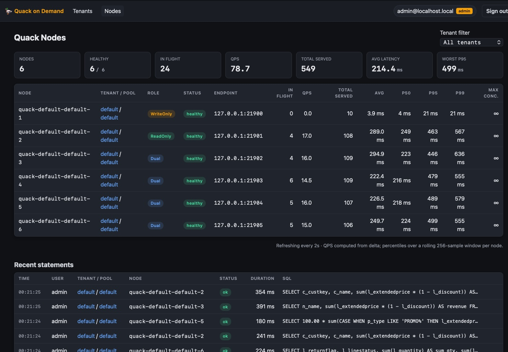

# 🦆 Quack on Demand

**A production-grade FlightSQL gateway in front of [DuckDB Quack](https://duckdb.org/docs/current/core_extensions/quack) + [DuckLake](https://duckdb.org/docs/extensions/ducklake.html).**

DuckDB ships with Quack, a minimal HTTP SQL endpoint that listens on `localhost`, generates a random auth token at startup, and explicitly recommends a reverse proxy in front of it for TLS, external auth, and authorization. Quack on Demand is that proxy with multi-tenancy, pluggable identity, table-level ACLs, role-aware routing, health probes, and a live admin UI built in.



---

## Features

- **Arrow Flight SQL edge** with auto-generated self-signed TLS (drop in a CA-signed cert for prod)
- **Multi-tenant pools** of Quack nodes. Each node is `READONLY`, `WRITEONLY`, or `DUAL`; the router classifies each statement and picks a compatible node
- **Pluggable authentication** through the vendored `AuthenticationService` chain:
  - Postgres / any JDBC backend (BCrypt-hashed passwords, free-form SQL template)
  - External JWT (HS256 / RS256 / public-key PEM)
  - OIDC providers: Keycloak (with ROPC), Google, Azure AD, AWS Cognito
- **Postgres-relational ACL** stored in `slkstate_acl_grant`, managed via REST, enforced per statement (SQL parser extracts table refs, the validator looks up grants for the user's principal)
- **Admin REST API** with an `X-API-Key` static key OR a session token minted via `/api/auth/login`
- **React admin console** at `/ui/` - tenant CRUD, pool CRUD, per-tenant ACL editor, live node dashboard (in-flight, total served, EWMA latency), admin-role gated
- **Single uber-jar** deployment; control-plane state lives next to DuckLake's metadata in the same Postgres database
- **Self-healing on restart** - dead Quack child processes are detected (PID + port probe) and respawned automatically before the edge accepts traffic
- **Every config key is overridable** via a `SL_QUACK_*` env var

---

## Architecture

```
┌─────────────────────┐
│  JDBC/ADBC client   │       Bearer or Basic auth
│  (DBeaver, Spark,   │  ────────────────────────────►
│   custom apps)      │                                ┌──────────────────────────────┐
└─────────────────────┘                                │   quack-on-demand manager    │
                                                       │                              │
┌─────────────────────┐    HTTPS (admin console)       │  ┌────────────────────────┐  │
│       Browser       │  ────────────────────────────► │  │  Tapir REST + React UI │  │
│   /ui/* admin page  │                                │  │   :20900               │  │
└─────────────────────┘                                │  └────────────────────────┘  │
                                                       │                              │
                                                       │  ┌────────────────────────┐  │
                                                       │  │  Arrow FlightSQL edge  │  │
                                                       │  │  :31338   (TLS)        │  │
                                                       │  │  • Auth (DB/JWT/OIDC)  │  │
                                                       │  │  • ACL validator       │  │
                                                       │  │  • Role-aware router   │  │
                                                       │  └────────┬───────────────┘  │
                                                       │           │                  │
                                                       │           ▼                  │
                                                       │   spawn-quack-node.sh        │
                                                       │           │                  │
                                                       └───────────┼──────────────────┘
                                                                   │
                                          ┌────────────────────────┼─────────────────────────┐
                                          ▼                        ▼                         ▼
                                  ┌──────────────┐         ┌──────────────┐          ┌──────────────┐
                                  │  Quack node  │         │  Quack node  │          │  Quack node  │
                                  │  WRITEONLY   │         │  READONLY    │          │   DUAL       │
                                  │  :21900      │         │  :21901      │          │  :21902      │
                                  └──────┬───────┘         └──────┬───────┘          └──────┬───────┘
                                         │                        │                         │
                                         └────────────────────────┼─────────────────────────┘
                                                                  │
                                                                  ▼
                                                ┌────────────────────────────────┐
                                                │   Postgres (DuckLake metadata) │
                                                │   • ducklake_*  (catalog)      │
                                                │   • slkstate_pool_state        │
                                                │   • slkstate_user              │
                                                │   • slkstate_acl_grant         │
                                                └────────────────────────────────┘
                                                                  +
                                                          object/file storage
                                                          (S3, GCS, FS, …)
```

---

## Quick start

```bash
cp .env.example .env                            # tweak ports / auth / admin password
LOAD_TPCH=true ./scripts/run-docker-compose.sh  # pulls starlakeai/quack-on-demand:latest + seeds TPC-H SF=1
```

That brings up Postgres + the manager and seeds the DuckLake catalog with TPC-H at scale factor 1 (~6M lineitem rows) into schema `tpch.tpch1`. The admin UI is on `http://localhost:20900/ui/` (default login `admin` / `admin` - change it in `.env`); the FlightSQL edge on `localhost:31338`.

Smoke-test the FlightSQL edge with the Python load tester:

```bash
pip install adbc_driver_flightsql adbc_driver_manager

# TLS-on server (compose default)
./scripts/loadtest/loadtest.py -w 2 -i 5

# Plaintext server (TLS=false in .env, or scripts/run-docker.sh default)
./scripts/loadtest/loadtest.py --url grpc://localhost:31338 -w 2 -i 5
```

Everything else - native run, Docker against an external Postgres, TPC-H seeding, corporate proxy setup, JDBC client configuration, REST API recipes, the full loadtest parameter table - lives in **[`RUNNING.md`](RUNNING.md)**.

---

## Configuration

Every scalar in `src/main/resources/application.conf` accepts a matching `SL_QUACK_*` env-var override. The most-used:

| Setting | Env var | Default |
|---|---|---|
| Manager REST port | `SL_QUACK_ON_DEMAND_PORT` | `20900` |
| FlightSQL edge port | `PROXY_PORT` | `31338` |
| FlightSQL TLS on/off | `PROXY_TLS_ENABLED` | `true` |
| State backend | `SL_QUACK_STATE_STORAGE` | `postgres` |
| Metastore host | `SL_QUACK_PG_HOST` | `localhost` |
| Metastore database | `SL_QUACK_PG_DBNAME` | `tpch` |
| Static admin key | `SL_QUACK_API_KEY` | unset |
| Admin usernames | `SL_QUACK_ADMIN_USERNAME` | `admin@localhost.local,admin` |
| Admin password | `SL_QUACK_ADMIN_PASSWORD` | `admin` |
| Enable DB auth | `SL_QUACK_AUTH_DB_ENABLED` | `false` |
| Enable ACL | `SL_QUACK_ACL_ENABLED` | `false` |

Pluggable auth backends, ACL store paths, K8s runtime, JWT keys - see `application.conf` for the full surface.

---

## REST API

All endpoints under `/api/*` require a valid `X-API-Key` (either the static `SL_QUACK_API_KEY` or a UI session token from `/api/auth/login`). `/health` and `/api/config/client` are open; `/ui/*` is open (the React app gates itself).

| Method | Path | Purpose |
|---|---|---|
| `POST` | `/api/auth/login`           | mint a session token (admin role required) |
| `POST` | `/api/auth/logout`          | revoke the current token |
| `GET`  | `/api/auth/whoami`          | verify session |
| `GET`  | `/api/tenant/list`          | list tenants + effective metastore |
| `POST` | `/api/tenant/create`        | create a tenant |
| `POST` | `/api/tenant/setMetastore`  | patch a tenant's metastore overrides |
| `POST` | `/api/tenant/delete`        | delete a tenant (must have no pools) |
| `GET`  | `/api/pool/list`            | list pools with live node metrics |
| `POST` | `/api/pool/create`          | spin up a pool |
| `POST` | `/api/pool/scale`           | scale up/down with role redistribution |
| `POST` | `/api/pool/stop`            | tear down |
| `POST` | `/api/node/setMaxConcurrent`| per-node concurrency cap |
| `POST` | `/api/node/quarantine`      | mark a node unhealthy |
| `POST` | `/api/node/restart`         | drain + restart a node |
| `GET`  | `/api/acl/grant/list?tenant=…` | list grants |
| `POST` | `/api/acl/grant/create`     | grant `(principal, target, permission)` |
| `POST` | `/api/acl/grant/upload`     | bulk insert |
| `POST` | `/api/acl/grant/delete/:id` | revoke |
| `GET`  | `/api/config/client`        | discovery: edge host/port/TLS (open) |
| `GET`  | `/health`                   | liveness + pool/node counts (open) |

---

## Admin UI

| Page | What it shows |
|---|---|
| **Login** | Username/password, admin-role gated |
| **/ ** (Tenants) | List + create + delete tenants, effective metastore preview |
| **/tenant/:tenant** | Tenant detail · pools · storage · **ACL grants editor** |
| **/pool/:tenant/:pool** | Pool nodes, JDBC/ODBC/ADBC connection strings, scale/stop |
| **/nodes** | Live cluster dashboard: per-node `inFlight`, `totalServed`, EWMA latency, role + health badges, per-tenant filter, auto-refresh every 2s |

---

## ACL model

Grants live in `slkstate_acl_grant` with shape:

```sql
(tenant_id, principal, catalog_name, schema_name, table_name, permission)
```

- `principal` follows the `type:name` convention - `user:alice`, `group:engineers`, `role:admin`
- Any of `catalog_name / schema_name / table_name` may be `NULL` to act as a wildcard
- Permissions: `SELECT | INSERT | UPDATE | DELETE | ALL` (`ALL` always wins)

When `acl.enabled=true` and `stateStorage=postgres`, `PostgresAclValidator` parses each incoming SQL statement, extracts the table references, and queries the table for matching grants. Non-SELECT statements (DDL / DML) are denied unless the principal holds a wildcard `ALL` grant.

**Principal expansion.** At validation time the authenticated session's `username`, `groups`, and `role` are expanded into `user:<username>`, `group:<g>` (one per group), and `role:<r>` principals; a grant matches if *any* of them does. So an OIDC user `alice` with groups `[engineers, analysts]` and role `viewer` triggers lookups for four principals at once - write your grants against whichever level of identity is stable.

Add a grant from the UI's tenant detail page, or via curl:

```bash
curl -H "X-API-Key: $TOKEN" -X POST http://localhost:20900/api/acl/grant/create \
  -H 'Content-Type: application/json' \
  -d '{"tenantId":"acme","principal":"user:alice",
       "catalogName":"tpch","schemaName":"main","tableName":"customer",
       "permission":"SELECT"}'
```

---

## Tech stack

- **Scala 3.7** - `enum`, given/using, derived ConfigReader
- **Cats Effect** + **fs2** for the runtime
- **Tapir** + **HTTP4s Ember** for the REST API
- **Apache Arrow Flight SQL 14** + `arrow-memory-unsafe` (pinned via `-Darrow.allocation.manager.type=Unsafe`)
- **DuckDB JDBC** embedded in the manager to bridge to Quack's binary wire (via `quack_query()` table function)
- **DuckLake** for shared catalog metadata + S3/FS data storage
- **PostgreSQL** for catalog metadata + control-plane state (`slkstate_*` tables)
- **React 18** + **Vite** + **react-router-dom** for the SPA (no UI framework - single dark-theme CSS file)

---

## Development

```bash
# Run the manager from sbt (forks JVM so `--add-opens` takes effect)
sbt run

# Run the test suite (574+ tests)
sbt test

# Build the uber-jar at distrib/quack-on-demand-assembly-*.jar
sbt assembly

# UI dev loop (proxies /api/* to localhost:20900)
cd ui && npm install && npm run dev
```

Project layout:

```
src/main/scala/ai/starlake/
├── quack/
│   ├── Main.scala                 # IOApp + wiring
│   ├── Config.scala               # ManagerConfig, FlightConfig, AdminConfig
│   ├── edge/                      # FlightSQL edge + router + adapter
│   │   ├── auth/                  # AuthenticationService + provider chain
│   │   ├── catalog/               # DuckLakeCatalogResolver (table/view lookup)
│   │   ├── config/                # AuthenticationConfig, AclConfig, SessionConfig, …
│   │   └── sql/                   # ACL + statement validators
│   ├── ondemand/                  # Pool supervisor + handlers + state
│   │   ├── api/                   # Tapir endpoints + DTOs + handlers
│   │   ├── runtime/               # Local + Kubernetes backends
│   │   └── state/                 # File + Postgres state stores
│   └── route/                     # StatementClassifier + Router + RoleMatcher
└── acl/                           # SQL parser + ACL model + multi-tenant store
scripts/
├── run-jar.sh       # Boot the manager from the uber-jar
├── stop-quack-on-demand.sh        # Graceful SIGTERM → SIGKILL escalation
├── start-quack-ducklake.sh        # Standalone single-node Quack for testing
├── load-tpch-dbgen.sh             # Generate TPC-H (SF override via $SF) into the metastore via DuckDB's dbgen()
└── spawn-quack-node.sh            # Called by LocalQuackBackend; do not invoke directly
ui/
└── src/                           # React SPA, built into src/main/resources/ui
```

---

## Operational notes

Defaults and design choices an operator should be aware of before going to production:

- **FlightSQL edge is authenticated by default; the admin password is `admin`.** `auth.database.enabled = true` and the manager seeds `slkstate_user` with the configured admin at boot. The default credentials (`admin@localhost.local / admin`) are fine for first-run; **rotate via `SL_QUACK_ADMIN_PASSWORD` before exposing the edge.**
- **REST API is OPEN by default.** The control-plane REST API (`/api/...`) is a separate gate. Until you set `SL_QUACK_API_KEY`, anonymous requests are accepted. The manager logs a loud warning at startup. Set the env var, or restrict the listening interface, before exposing the manager beyond `localhost`.
- **DML grants in ACL mode are coarse-grained.** `INSERT`/`UPDATE`/`DELETE` are denied unless the principal holds a wildcard `ALL` grant. Per-table DML grants need the ACL `TableExtractor` to also walk non-SELECT statements; today it only enumerates reads.
- **K8s reconciliation is conservative.** Local mode detects dead child PIDs at startup and respawns; K8s mode trusts the apiserver's liveness probe (pods without a Linux PID are kept as-is, with the `HealthProbe` catching drift after one tick). Implementing pod-status reconciliation requires `KubernetesQuackBackend.discoverExisting()` to wire into the apiserver.
- **Edge session caching trades latency for revocation lag.** Auth re-validation happens at the TTL boundary (`sessionTtlSec`, default 1h), not on every call. A revoked OIDC token still works for up to one TTL window - shrink the TTL or restart the manager for immediate effect.

See [`docs/superpowers/FOLLOWUPS.md`](docs/superpowers/FOLLOWUPS.md) for the full triaged list, including recently-closed items (admin user seeding, ACL Phase 2, Postgres state store, reconcile-on-restart, group/role propagation, etc.).

---

## License

Apache 2.0.

## Community

- **Questions / discussion** -> [GitHub Discussions](https://github.com/starlake-ai/quack-on-demand/discussions)
- **Bug or feature** -> file an issue using the templates (the blank-issue path is disabled on purpose)
- **Security report (private)** -> email `hayssam.saleh@starlake.ai`

## Contributing

PRs welcome. See [CONTRIBUTING.md](CONTRIBUTING.md) for the dev loop
(build, test, commit conventions, PR flow) and
[CODE_OF_CONDUCT.md](CODE_OF_CONDUCT.md) for the community standards we
follow. Start with an issue labelled `good first issue` if you'd like a
small, well-scoped task.
