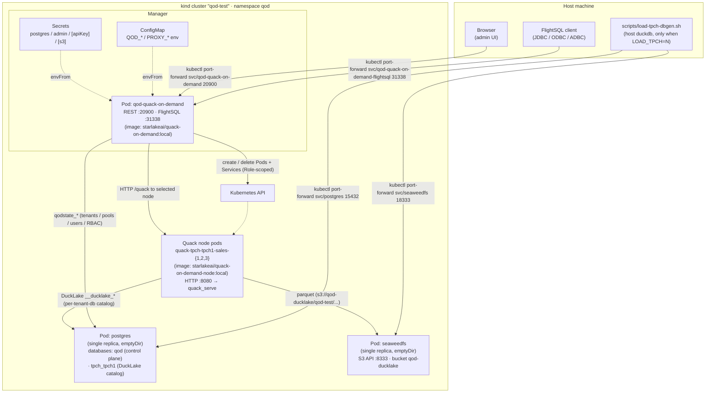

# WIP Local test rig (kind + Helm)

End-to-end smoke for the chart on a local [kind](https://kind.sigs.k8s.io/) cluster. The rig is intentionally self-contained — it does not require an external Postgres or a published image.

## Prerequisites

- `kind` 0.20+
- `kubectl`
- `helm` 3.12+
- `docker`
- `duckdb` CLI on `$PATH` (only required when seeding via `LOAD_TPCH`; otherwise skip)
- ~8 GB free RAM (the manager image + Quack node image + Postgres + SeaweedFS + kind nodes)

## One command

```bash
./charts/quack-on-demand/local-stack-k8s/run-local-stack-k8s.sh
```

This:

1. Creates a kind cluster named `qod-test` (reused if it already exists).
2. Resolves the manager + Quack-node images. With the default `BUILD=0` it reuses local `:local`-tagged images, pulling `starlakeai/quack-on-demand{,-node}:latest-snapshot` from Docker Hub and retagging as `:local` if absent. `BUILD=1` runs `docker build` for both from the source tree first.
3. Loads both images into the kind cluster.
4. Applies a minimal in-cluster Postgres ([`local-postgres.yaml`](local-postgres.yaml)) and SeaweedFS ([`seaweedfs.yaml`](seaweedfs.yaml)) — one Pod + Service each, ephemeral `emptyDir` storage. **Not production-grade** — that's the point. The chart itself expects an external Postgres + S3-compatible store; these manifests exist only to satisfy the smoke.
5. `helm install`s the chart pointing at that Postgres for the DuckLake catalog + control plane, SeaweedFS for the parquet `s3://` data path, and the local image, with FlightSQL TLS on (auto-generated self-signed cert) and an inline admin password.
6. Waits for the manager pod to be `Ready` and `/health` to return OK.
7. Verifies the manager spawned the bootstrap Quack node pods (3 by default — one each of WriteOnly / ReadOnly / Dual).

## Architecture

What the script ends up creating, end-to-end. Everything runs in the single `qod` namespace of the `qod-test` kind cluster; the host only opens short-lived port-forwards.



The pieces, one per row of the diagram:

- **Host port-forwards** are the only way anything outside the cluster talks to the stack. `run-local-stack-k8s.sh` prints the exact commands at the end.
- **Postgres** holds both the manager's `qodstate_*` control plane and each tenant-db's `__ducklake_*` catalog tables. They live in separate Postgres databases (`qod` vs. `${tenant}_${tenantDb}`) so the control plane never collides with DuckLake metadata.
- **SeaweedFS** speaks the S3 API and stores the parquet that DuckLake's catalog references. The chart wires `storage.dataPath=s3://qod-ducklake/qod-test`; both the manager and every Quack node use the same URL.
- **Manager** talks to the K8s API via a `Role` (not a `ClusterRole`) scoped to its own namespace, so it can spawn / delete Pods + Services for Quack nodes without touching anything else in the cluster.
- **Quack node pods** are spawned by the manager (not by Helm). They listen on `:8080`, attach the per-tenant-db DuckLake catalog to their local DuckDB, and serve the manager's per-statement `/quack` HTTP requests.

## Env knobs

| Var | Default | Purpose |
|---|---|---|
| `KIND_CLUSTER` | `qod-test` | kind cluster name |
| `IMAGE` | `quack-on-demand:local` | manager image ref |
| `NAMESPACE` | `qod` | install namespace |
| `RELEASE` | `qod` | helm release name |
| `BUILD` | `0` | `0` reuses local `:local`-tagged images (falling back to `:latest-snapshot` from Docker Hub if absent); `1` runs `docker build` first. Same convention as `scripts/run-jar.sh`. |
| `NUKE` | `0` | `1` deletes the namespace before reinstalling — wipes the Postgres `emptyDir`, the helm release, and every Quack node pod. Mirrors `NUKE` in `scripts/run-jar.sh`. |
| `LOAD_TPCH` | unset | TPC-H seed. Unset = skip; positive integer = scale factor (`LOAD_TPCH=1` ≈ 6M lineitem rows, `LOAD_TPCH=10` ≈ 60M). Seeds TPC-H into the in-cluster Postgres + SeaweedFS before the manager boots — same `scripts/load-tpch-dbgen.sh` flow `run-jar.sh` uses. Requires `duckdb` on the host. |

```bash
# Fresh boot from a clean Postgres + TPC-H SF=1 seeded:
NUKE=1 LOAD_TPCH=1 ./charts/quack-on-demand/local-stack-k8s/run-local-stack-k8s.sh

# Just nuke and reinstall without seeding:
NUKE=1 ./charts/quack-on-demand/local-stack-k8s/run-local-stack-k8s.sh

# Force a fresh docker build (default is BUILD=0 = reuse local / pull from Hub):
BUILD=1 ./charts/quack-on-demand/local-stack-k8s/run-local-stack-k8s.sh
```

The script also auto-cleans orphan `managed-by=quack-on-demand` pods + services from a prior failed bootstrap before installing — so reruns without `NUKE=1` still recover cleanly (the manager's bootstrap would otherwise 409 on the leftover pod name).

## Verify by hand

After the script reports `smoke OK` (the script prints the exact port-forward commands at the end). The full names that Helm renders for the default release/chart combo are:

```bash
# Port-forward the admin UI (REST + UI on :20900)
kubectl -n qod port-forward svc/qod-quack-on-demand 20900:20900
# Open http://localhost:20900/ui/  (login admin / admin)

# Port-forward FlightSQL (gRPC+TLS on :31338, manager-issued self-signed cert)
kubectl -n qod port-forward svc/qod-quack-on-demand-flightsql 31338:31338
# JDBC: jdbc:arrow-flight-sql://localhost:31338?useEncryption=true&disableCertificateVerification=true&user=admin&password=admin&tenant=tpch&pool=sales

# Watch the quack node pods the manager spawns
kubectl -n qod get pods -l managed-by=quack-on-demand -w
```

Note: Helm prepends the chart name (`quack-on-demand`) to the release name (`qod`) unless the release name already contains it. So services land at `qod-quack-on-demand`, not `qod`. The script's tail message resolves this from the cluster so its copy-paste lines always match what's actually there.

## Tear down

```bash
./charts/quack-on-demand/local-stack-k8s/stop-local-stack-k8s.sh
```

## Known limitations

- Postgres data is ephemeral (`emptyDir`). Recreating the cluster wipes all state — that's a feature for a smoke rig.
- By default (`BUILD=0`) the script reuses the local `:local`-tagged images, pulling `:latest-snapshot` from Docker Hub if they're absent. Set `BUILD=1` to rebuild from the local Dockerfile (cached layers make reruns fast once JDK + sbt deps are cached).
- FlightSQL TLS is on with a manager-issued self-signed cert. Clients must skip cert verification (`useEncryption=true&disableCertificateVerification=true` for JDBC, `--insecure` for `loadtest.py`). Production deploys should mount a CA-signed cert via `flightsql.tls.existingSecret`.