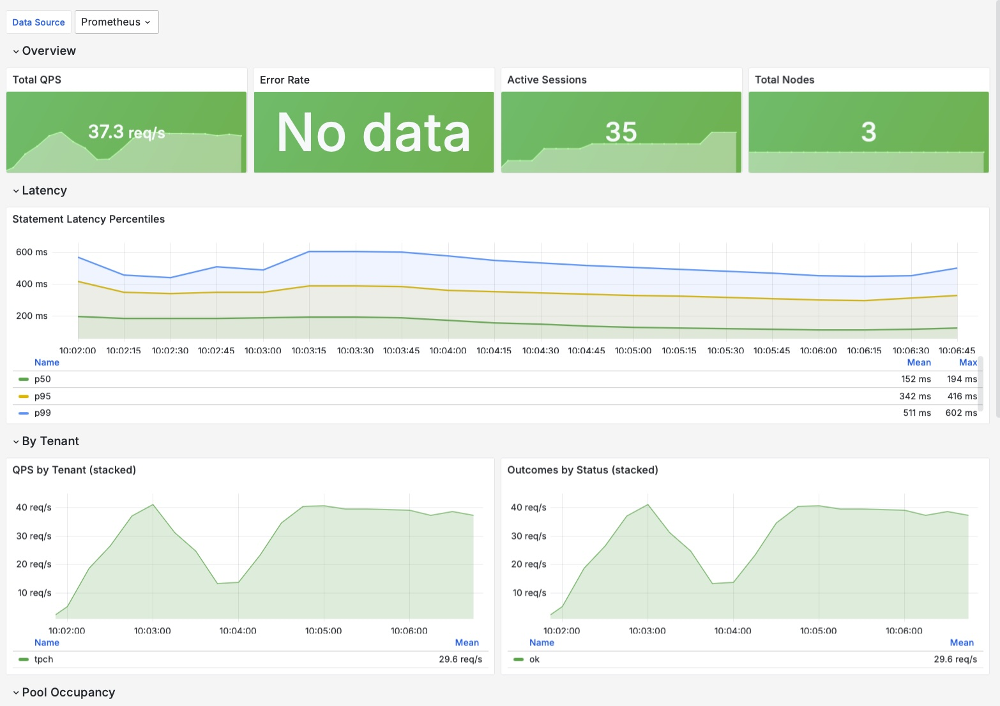

# Observability

## 1. Overview

This directory documents the observability surface of the Quack-on-Demand manager process. Metrics are collected via Micrometer and routed to exactly one sink per process. The active sink is selected by the `quack-on-demand.metrics.sink` key in `application.conf`, overridable at runtime with `QOD_METRICS_SINK`. Supported values are `prometheus`, `aws`, `azure`, `gcp`, and `none`.



## 2. Prometheus pull (`sink = "prometheus"`)

Prometheus is the default sink. When active, the manager exposes a standard scrape endpoint with no authentication (same policy as `/health`):

```
GET http://<host>:20900/metrics
```

Sample Prometheus scrape configuration:

```yaml
scrape_configs:
  - job_name: quack-on-demand
    static_configs:
      - targets: ['quack-manager.svc:20900']
    metrics_path: /metrics
```

### 2.1 Local stack (Prometheus + Grafana via docker compose)

The bundled `scripts/run-docker-compose.sh` brings up the whole stack
in one shot: manager + Postgres + Prometheus + Grafana, with TPC-H
SF=1 already loaded into the bootstrap tenant-db so the dashboard
has live data to chart the moment Grafana opens.

```bash
# One command: manager + Postgres + TPC-H SF=1 seed + Prometheus + Grafana.
LOAD_TPCH=1 PROFILES=observability ./scripts/run-docker-compose.sh

# Wipe first if you want a clean slate.
NUKE=1 LOAD_TPCH=1 PROFILES=observability ./scripts/run-docker-compose.sh
```

The `observability` compose profile pulls in the Prometheus + Grafana
containers defined in the top-level `docker-compose.yml`; Prometheus
scrapes the manager container directly over the compose network (no
`host.docker.internal` indirection needed). Grafana is preprovisioned
with the Prometheus datasource (UID `prometheus-local`) so the bundled
dashboard renders without manual datasource selection.

```text
# UIs (printed by run-docker-compose.sh at the end of boot)
Manager UI:    http://localhost:20900/ui/       (admin / admin)
Prometheus:    http://localhost:9090            (try query: up)
Grafana:       http://localhost:3000            (anonymous admin; no login)
               Dashboard: "Quack-on-Demand - Operator Overview"
```

Tear down:

```bash
# Stop the full stack (keeps pgdata + Prometheus history).
docker compose -f docker-compose.yml --profile observability down

# Or wipe everything and start fresh next time.
NUKE=1 PROFILES=observability ./scripts/run-docker-compose.sh
```

This directory's standalone `docker-compose.yml` is a secondary
option for when the manager runs **outside** docker compose (e.g.
inside Kubernetes reached via port-forward); see Section 2.2.

### 2.2 Standalone Prometheus + Grafana (manager runs elsewhere)

When the manager is **not** part of the docker-compose stack -- say
it runs inside Kubernetes (via `helm install` against a kind cluster
or a real cluster) and you port-forward `:20900` to the host -- bring
up only the observability containers from this directory:

```bash
# Manager somewhere else (example: kube port-forward)
kubectl -n qod port-forward svc/qod-quack-on-demand 20900:20900 &

# Just Prometheus + Grafana, scraping the port-forwarded manager
# via host.docker.internal:20900 (mapped through extra_hosts on Linux,
# automatic on Docker Desktop).
docker compose -f observability/docker-compose.yml up -d

# Grafana http://localhost:3000  (anonymous admin)
# Prometheus http://localhost:9090

# Tear down (keeps history)
docker compose -f observability/docker-compose.yml down

# Wipe data volumes too
docker compose -f observability/docker-compose.yml down -v
```

Grafana's preprovisioning is identical to the integrated path: same
datasource UID, same auto-loaded dashboard. Pick whichever path
matches where your manager lives.

## 3. Cloud push (`sink = "aws" | "azure" | "gcp"`)

When a cloud sink is selected the manager pushes metrics on a fixed cadence (default 60 s) using the respective cloud SDK. The `/metrics` Prometheus endpoint is **not** exposed in cloud-push mode.

| Sink | Set | Required config | Credential source |
|---|---|---|---|
| `aws` | `QOD_METRICS_SINK=aws` | `QOD_METRICS_AWS_NAMESPACE` (default `quack-on-demand`) | `DefaultCredentialsProvider` chain - IAM role, env, profile |
| `azure` | `QOD_METRICS_SINK=azure` | `QOD_METRICS_AZURE_KEY` (Application Insights instrumentation key - **REQUIRED**) | `DefaultAzureCredential` - managed identity, env, CLI |
| `gcp` | `QOD_METRICS_SINK=gcp` | `QOD_METRICS_GCP_PROJECT_ID` (**REQUIRED**) | ADC - `GOOGLE_APPLICATION_CREDENTIALS`, GCE metadata, gcloud |

Push cadence defaults to 60 s per backend. Override with:

- `QOD_METRICS_AWS_STEP_SEC`
- `QOD_METRICS_AZURE_STEP_SEC`
- `QOD_METRICS_GCP_STEP_SEC`

**Only ONE sink runs per process.** If `metrics.sink = "aws"`, the `/metrics` Prometheus endpoint is **not** exposed and no other cloud sink is active. There are no per-backend `enabled` flags; the single `sink` field is the sole selector.

## 4. Disabling metrics

Set `metrics.sink = "none"` (or `QOD_METRICS_SINK=none`). No `/metrics` endpoint is mounted; no cloud push occurs; all counters, timers, and gauges registered against the manager become no-ops.

## 5. Common labels

Set the following environment variables to attach static labels to every emitted series. These are useful for distinguishing environments in a shared Grafana instance (e.g. `prod-eu`, `prod-us`, `staging`):

| Variable | HOCON key | Purpose |
|---|---|---|
| `QOD_METRICS_DEPLOYMENT` | `metrics.commonTags.deployment` | Deployment name, e.g. `prod-eu` |
| `QOD_METRICS_REGION` | `metrics.commonTags.region` | Cloud region, e.g. `eu-west-1` |

Example:

```bash
export QOD_METRICS_DEPLOYMENT=prod-eu
export QOD_METRICS_REGION=eu-west-1
```

## 6. Grafana dashboard

`grafana-dashboard.json` is a single-screen operator overview covering all key signals. It was validated with `python3 -m json.tool` and is ready to import.

**Import procedure:**

1. In Grafana 10.x, navigate to **Dashboards → New → Import**.
2. Click **Upload JSON file** and select `docs/observability/grafana-dashboard.json`.
3. At the datasource prompt, select your Prometheus datasource. The `${datasource}` variable in the JSON resolves to its UID automatically.
4. Click **Import**.

**Dashboard layout:**

| Row | Panels |
|---|---|
| Overview | Total QPS, Error Rate, Active Sessions, Total Nodes |
| Latency | p50 / p95 / p99 statement duration percentiles |
| By Tenant | Stacked QPS per tenant, Outcomes by status |
| Pool Occupancy | Node count bar chart by tenant / pool / role |
| Node Health | Table: healthy, draining, in-flight, EWMA latency per node |
| DuckDB Engine | Buffer-manager memory and spill-to-disk bytes per node (health-probe scrape) |
| JVM | Heap used, GC pause rate, live threads, process uptime |

**Expected metric names** (all registered by the manager):

- `statements_total` - counter, labels: `tenant`, `pool`, `status`
- `statement_duration_seconds` - histogram, labels: `tenant`, `pool`
- `node_healthy` - gauge, labels: `tenant`, `pool`, `node_id`, `role`
- `node_draining` - gauge, labels: `tenant`, `pool`, `node_id`, `role`
- `node_in_flight` - gauge, labels: `tenant`, `pool`, `node_id`, `role`
- `node_ewma_latency_seconds` - gauge, labels: `tenant`, `pool`, `node_id`, `role`
- `node_duckdb_memory_used_bytes` - gauge, labels: `tenant`, `pool`, `node_id`, `role` (DuckDB buffer-manager usage, scraped by the health probe)
- `node_duckdb_temp_storage_bytes` - gauge, same labels (buffer-manager temp storage)
- `node_duckdb_spill_files` / `node_duckdb_spill_bytes` - gauges, same labels (live spill-to-disk files and their total size)
- `pool_nodes` - gauge, labels: `tenant`, `pool`, `role`
- `flightsql_sessions_active` - gauge
- `jvm_memory_used_bytes` - gauge (Micrometer JVM binder)
- `jvm_gc_pause_seconds_sum` - counter (Micrometer JVM binder)
- `jvm_threads_live_threads` - gauge (Micrometer JVM binder)
- `process_uptime_seconds` - gauge (Micrometer process binder)