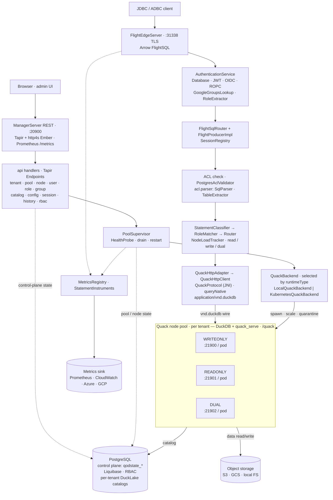

Quack on Demand is a gateway that puts a multi-tenant, access-controlled, horizontally-scaled SQL surface in front of DuckDB. Clients speak Arrow Flight SQL to one endpoint; the gateway authenticates them, authorizes each statement, and routes it to one of many DuckDB Quack nodes backed by shared DuckLake catalogs. This page is the conceptual overview; the pages it links to go deeper, and the [Architecture map](/contributing/architecture-map) covers the codebase for contributors.

## The planes

The system separates a control plane from a data plane:

- **Control plane** - the manager process: a REST API and React admin UI for managing tenants, databases, pools, users, and access control, plus the supervisor that spawns and tracks nodes. Its state lives in the control-plane store (see [State storage](/concepts/state-storage)).
- **Data plane** - the FlightSQL edge and the Quack nodes behind it. This is where queries flow. The edge is stateless per request beyond the session it tracks; the nodes hold the DuckDB engines.

Both run in a single uber-jar exposing three sockets: the manager REST + UI, the FlightSQL edge, and the range of child Quack nodes.

## The object model

Three nested levels organize everything (see [Tenancy model](/concepts/tenancy)):

- A **tenant** is the isolation boundary and selects its users' auth provider.
- A **tenant-db** is a database: a separate Postgres database holding a DuckLake catalog and a data path (see [DuckLake catalogs](/concepts/catalogs)).
- A **pool** is a set of Quack nodes bound to one tenant-db, and is what clients connect to.

## The request lifecycle

When a client runs a statement, it passes through a fixed sequence:

1. **Authenticate.** The edge validates the connection's credential (database password, JWT, or OIDC) and resolves the target `(tenant, pool)`; the owning tenant-db is resolved server-side. See [Authenticating](/connecting/authenticating).
2. **Authorize.** When ACL is enabled, the statement is parsed and every table access is checked against the principal's effective permissions before it touches a node. See the [Access control model](/operating/rbac-model).
3. **Classify and route.** The statement is classified read / write / DDL and dispatched to the least-loaded node whose role can serve it; an open transaction pins to its node. See [Routing](/concepts/routing) and [Sessions and transactions](/concepts/sessions-transactions).
4. **Execute and stream.** The chosen DuckDB node runs the SQL against its DuckLake catalog and streams Arrow batches back through the edge to the client.

## Why this shape

- **DuckDB for compute, DuckLake for state.** Each node is a fast embedded engine; the durable catalog and Parquet data live in shared Postgres + object storage, so nodes are interchangeable and a pool can scale horizontally over one consistent view.
- **One endpoint, many nodes.** Clients see a single Flight SQL endpoint; the gateway hides node placement, load balancing, transaction pinning, and failover-with-retry.
- **Access control at the gateway.** Authentication and per-statement authorization happen once, at the edge, independent of which node executes, so the same RBAC model covers native and federated tables alike.

## The pipeline in detail

**Two paths into Postgres.** The **manager** owns the control plane: it writes `qodstate_tenant` / `qodstate_tenant_db` / `qodstate_pool` / `qodstate_node` on tenant + pool CRUD, and resolves the cached `EffectiveSet` for each authenticated session at handshake. Each **Quack node** owns the data plane against its tenant-db, reading and writing that DB's DuckLake `__ducklake_*` catalog tables directly. Two databases per tenant-db deployment (control-plane `qod` + tenant-db `${tenant}_${tenantDb}`) keep the control plane and DuckLake catalog cleanly separated while sharing one Postgres cluster.

## Where to go next

- Operators: start with [Deployment](/operating/deploy-local) and [Tenants and databases](/operating/tenants-databases).
- Client developers: [Connecting clients](/connecting/clients).
- Contributors: the [Architecture map](/contributing/architecture-map) and [Extending the manager](/contributing/extending).
